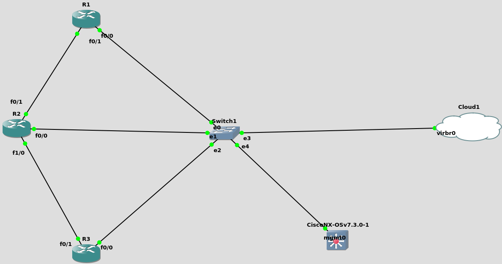

# ansible-network

## My topology
 
For my tests on labs i use GNS3

The R1 R2 R3 represent Cisco devices (router 3745)

The Cisco NX OS represent switch NX-OS

Other equipment is arriving ...



### Tasks

For the task : send_command.yml

-e 'target="SWITCHS"'
or
-e 'target="SWITCHS, ROUTERS"'
or
-e 'target="ROUTERS"'

Run:

```

ansible-playbook -i hosts.yml tasks/send_command.yml -e 'target="SWITCHS"' -e 'target_command="show run"'

```

For the task : backup_running_config.yml

-e 'target="SWITCHS"'
or
-e 'target="SWITCHS, ROUTERS"'
or
-e 'target="ROUTERS"'

Run:

```

ansible-playbook -i hosts.yml tasks/backup_running_config.yml -e 'target="SWITCHS"'

```


#### 